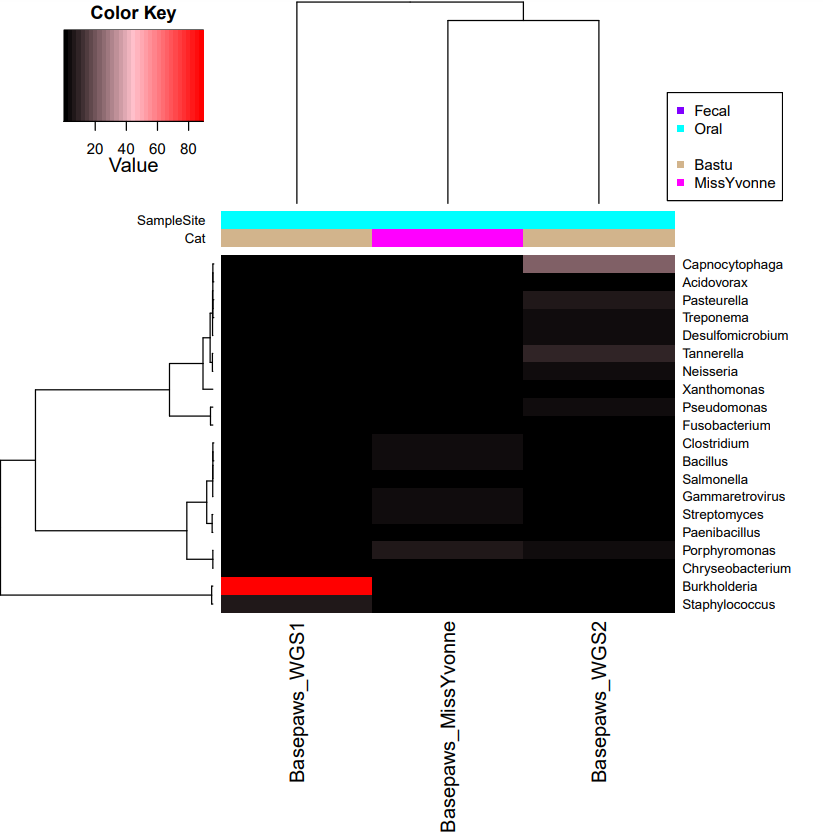
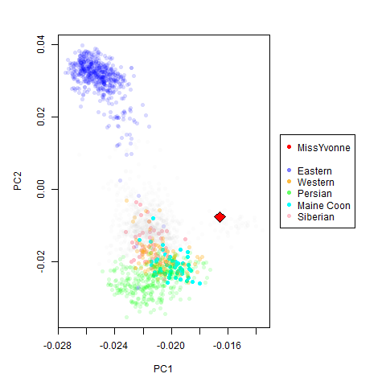
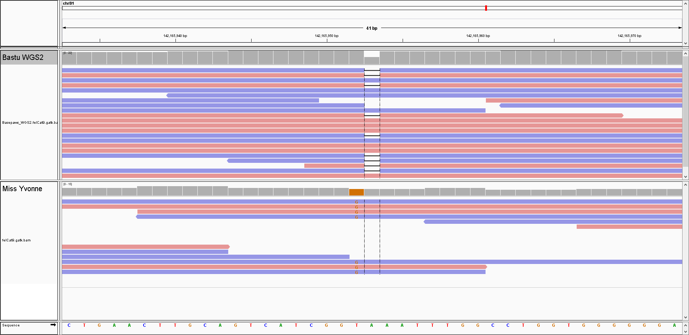

**basepaws (mouth swab, with raw data as FASTQ+gVCF)**:

A [Whole Genome Sequencing](https://basepaws.com/products/whole-genome-sequencing?variant=41082749976773) kit was ordered for [Miss Yvonne](https://www.petfinder.com/cat/miss-yvonne-71559819/ca/los-angeles/kitten-rescue-ca55/), whose sample was collected at [Tail Town](https://www.tailtowncats.com/) on 5/10/2024.

## Raw Data from Basepaws

**Interleaved FASTQ #1 (*Run 317, Lane 1*):** [AC.GJ.95-31220913500144-LP.1857.H11-L1.R317-WGS.fastq.gz](https://storage.googleapis.com/miss-yvonne-cat-genome/AC.GJ.95-31220913500144-LP.1857.H11-L1.R317-WGS.fastq.gz)
 - Also available in [precisionFDA](https://precision.fda.gov/home/files/file-GqVf1J805PZb38VJK1y69f5Z-2)

**Interleaved FASTQ #2 (*Run 317, Lane 8*):** [AC.GJ.95-31220913500144-SP.441.A6-L8.R317-WGS.fastq.gz](https://storage.googleapis.com/miss-yvonne-cat-genome/AC.GJ.95-31220913500144-SP.441.A6-L8.R317-WGS.fastq.gz)
 - Also available in [precisionFDA](https://precision.fda.gov/home/files/file-GqVbVp80xxvXVk3k5yy8G3yz-2)

**Provided gVCF:** [missyvonne.gvcf.gz](https://storage.googleapis.com/miss-yvonne-cat-genome/missyvonne.gvcf.gz)
 - Also available in [precisionFDA](https://precision.fda.gov/home/files/file-GqVf1f80bfGGXQ31PygFb6jB-2)

***Index* for Provided gVCF:** [missyvonne.gvcf.gz.tbi](https://storage.googleapis.com/miss-yvonne-cat-genome/missyvonne.gvcf.gz.tbi)
 - Also available in [precisionFDA](https://precision.fda.gov/home/files/file-GqVf1f0007qFQ4Kgkgq4BKyy-2)

## Processed Intermediate Files

**Combined Forward (*R1*) Read:** [Basepaws_MissYvonne_R1.fastq.gz](https://storage.googleapis.com/miss-yvonne-cat-genome/Basepaws_MissYvonne_R1.fastq.gz)

**Combined Reverse (*R2*) Read:** [Basepaws_MissYvonne_R2.fastq.gz](https://storage.googleapis.com/miss-yvonne-cat-genome/Basepaws_MissYvonne_R2.fastq.gz)

The *fastp*-trimmed reads have not directly been uploaded.  However, the output *reports* (.html and .json) are uploaded in this repository.

Similar files for *fastp* for Bastu (as well as for human reads for myself) can be found [here](https://github.com/cwarden45/Bastu_Cat_Genome/tree/master/Basepaws_Notes/Reformat_Basepaws_WGS2_and_Combine/fastp_results).  Files matching Miss Yvonne's data were created using `run_fastp-AltParam2.sh`.

**Filtered .bam Alignment File (only for bacterial and viral sequences) :** [Basepaws_MissYvonne.bacteria.bam](https://storage.googleapis.com/miss-yvonne-cat-genome/Basepaws_MissYvonne.bacteria.bam)

***Index* for Filtered .bam Alignment File (only for bacterial and viral sequences) :** [Basepaws_MissYvonne.bacteria.bam.bai](https://storage.googleapis.com/miss-yvonne-cat-genome/Basepaws_MissYvonne.bacteria.bam.bai)

**Bacterial and Viral Quantification using `samtools idxstats` :** [Basepaws_MissYvonne_idxstats.txt](https://storage.googleapis.com/miss-yvonne-cat-genome/Basepaws_MissYvonne_idxstats.txt)

**Alignment Statistics from *Picard* `MarkDuplicates` :** [Basepaws_MissYvonne_MarkDuplicates_BWA_MEM_metrics.txt](https://storage.googleapis.com/miss-yvonne-cat-genome/Basepaws_MissYvonne_MarkDuplicates_BWA_MEM_metrics.txt)

Similar output files (for *BWA-MEM* with `samtools idxstats` quantification) for 2 libraries for my cat (Bastu) can be found [here](https://github.com/cwarden45/Bastu_Cat_Genome/tree/master/Basepaws_Notes/Reformat_Basepaws_WGS2_and_Combine/Additional_Alignments/Extended_Reference-2024).  Files matching Miss Yvonne's data were created using `run_BWA-MEM_PE.py`.

*Kraken2* output files (**after** *fastp* trmming) for 2 libraries for my cat (Bastu) can be found [here](https://github.com/cwarden45/Bastu_Cat_Genome/tree/master/Basepaws_Notes/Reformat_Basepaws_WGS2_and_Combine/fastp_results/Kraken-OUT).  The new sample for Miss Yvonne was also processed using `run_Kracken2_Bracken-FASTQ-PE.py` (with the earlier version [here](https://github.com/cwarden45/Bastu_Cat_Genome/blob/master/Basepaws_Notes/Reformat_Basepaws_WGS2_and_Combine/fastp_results/run_Kracken2_Bracken-FASTQ-PE.py)), and those results are saved within the following folder in this repository:

***Kraken2* Classification Files (folder) :** [Kraken-OUT](https://github.com/cwarden45/MissYvonne_Cat_Genome/tree/main/Kraken-OUT)

Using a strategy otherwise similar for the ancestry analysis (aligned to *felCat8*), an alignment to ***felCat9*** to check the alignments at a site of interest for a variant was also created and uploaded to the location below (specifically, using [align_BWA_MEM-felCat9.py](https://github.com/cwarden45/MissYvonne_Cat_Genome/blob/main/align_BWA_MEM-felCat9.py)):

**Alignment File (only aligned to *felCat9* cat genome) :** [felCat9.gatk.bam](https://storage.googleapis.com/miss-yvonne-cat-genome/felCat9.gatk.bam)

***Index* for Alignment File (only aligned to *felCat9* cat genome) :** [felCat9.gatk.bai](https://storage.googleapis.com/miss-yvonne-cat-genome/felCat9.gatk.bai)

## Additional Files

`create_PairedEnd_R1_and_R2--WITH_STARTING_LIBRARY_INFO.pl` - script to convert provided reads to paried in format.  Unlike the [second WGS sample](https://github.com/cwarden45/Bastu_Cat_Genome/blob/master/Basepaws_Notes/Reformat_Basepaws_WGS2_and_Combine/create_PairedEnd_R1_and_R2.pl) for Bastu, there is library information that was kept in the interleaved reads for Miss Yvonne (and the code was modified to keep that information).

`combine_reads.sh` - script used to combine reads from 2 libraries (still separated for forward *R1* reads and reverse *R2* reads).

`create_Kracken2_Bracken_table-MULTI_CAT.R` was used to create a heatmap to visualize reads along with the data from Bastu (for ***Kraken2* classifications**):



An earlier heatmap (with only bacterial alignments) is available [here](https://github.com/cwarden45/Bastu_Cat_Genome/blob/master/Basepaws_Notes/Reformat_Basepaws_WGS2_and_Combine/fastp_results/Oral6SUB3_FILTERED_Braken_genera-heatmap_quantified-TOP20.PNG).  Both have [heatmap.3.R](https://github.com/obigriffith/biostar-tutorials/blob/master/Heatmaps/heatmap.3.R) as a dependency.

`create_BWA-MEM_table-NORMALIZE_KRAKEN2_BRAKEN.R` was used to create a heatmap to visualize reads along with the data from Bastu (for the **custom BWA-MEM** reference):


An earlier heatmap (also including human samples) is available [here](https://github.com/cwarden45/Bastu_Cat_Genome/blob/master/Basepaws_Notes/Reformat_Basepaws_WGS2_and_Combine/Additional_Alignments/n6_Oral_Bowtie2-heatmap.PNG).  An important change had to be made relative to the earlier code, due to the additional of viral sequences.  **However, there is some consistency in the results for *Kraken2* classifications and the custom *BWA-MEM* alignment.**

*Some caution should be taken with interpretation*: for example, there was a *very large library effect* between the two samples for Bastu.  Nevertheless, the earlier *Kraken2* classifications *may* indicate that different bacteria could be present in Miss Yvonne versus Bastu.  For example, the genus ***Porphyromonas*** includes *Porphyromonas gingivalis*.  Moreover, **Porphyromonas_NC_010729.1** is included in the custom reference set, and the heatmap also shows a relative increase in abundance for Miss Yvonne (versus Bastu, indicated by the more intense shade of pink for the column representing the quantification for Miss Yvonne).  Also, while not shown in any of the heatmaps, the [output](https://github.com/cwarden45/MissYvonne_Cat_Genome/blob/main/Kraken-OUT/Basepaws_MissYvonne_Kraken2.bracken) from *Bracken* (downstream of *Kraken2*) indicates the highest amount of counts assigned to ***Porphyromonas gingivalis*** (relative to other species within the genus *Porphyromonas*).  That said, even if a *Porphyromonas* species is playing a role in Miss Yvonne's oral health, I am not currently sure about implications for (additional) treatment.

**Broad ancestry** analysis with part of publicly available cat SNP chip data was performed based upon scripts [saved here](https://github.com/cwarden45/Bastu_Cat_Genome/tree/master/Basepaws_Notes/ADMIXTURE%2BRFMix_ReAnalysis_with_Gandolfi-SNP-chip).  This starts with `create_GATK_gVCF.sh` (for a specific reference), and this does **not** use the provided gVCF from *Basepaws*.  This has to be run after generating an alignment using [align_BWA_MEM.py](https://github.com/cwarden45/Bastu_Cat_Genome/blob/master/Basepaws_Notes/align_BWA_MEM.py).  For clarity, the gVCF code is shown below:

```
#!/bin/sh

BAM=felCat8.gatk.bam
gVCF=felCat8.gatk.gVCF
gVCF2=felCat8.gatk.flagged.gVCF
REF=../../felCat8_Ref/felCat8.fa
DICT=../../felCat8_Ref/felCat8.dict

#java -jar -Xmx6g /opt/picard-v2.21.9.jar CreateSequenceDictionary R=$REF O=$DICT

/opt/gatk-4.1.4.1/gatk --java-options -Xmx6g HaplotypeCaller --input $BAM --reference $REF --output $gVCF --dont-use-soft-clipped-bases true --emit-ref-confidence GVCF
/opt/gatk-4.1.4.1/gatk --java-options -Xmx6g VariantFiltration --variant $gVCF --output $gVCF2 -window 35 -cluster 3 -filter-name QD -filter "QD < 2.0" -filter-name FS -filter "FS > 30.0"
```

Likewise, the exact *align_BWA_MEM.py* script has been uploaded in [this repository](https://github.com/cwarden45/MissYvonne_Cat_Genome/blob/main/align_BWA_MEM.py).  Hopefully, the remaining steps can be followed from the repository for Bastu.  Any files that are only related to the public SNP chip data already exist, so I did not have to re-run those steps for Miss Yvonne.

While not explictly mentioned in the step-by-step instructions, the [convert_PED_to_POP.pl](https://github.com/cwarden45/Bastu_Cat_Genome/blob/master/Basepaws_Notes/ADMIXTURE%2BRFMix_ReAnalysis_with_Gandolfi-SNP-chip/convert_PED_to_POP.pl) file was needed to run supervised ADMIXTURE analysis.  Also, for the supervised ADMIXTURE analysis, "-SUPERVISED" was *manually* added to the file names.  This also means that `admixture $PREFIX.bed 2 --supervised` had to be run separately and before `admixture $PREFIX.bed 2`.


**Selected intermediate files (and scripts) for analysis of the data for Miss Yvonne** have also been saved in the following folder : [ADMIXTURE+RFMix_ReAnalysis_with_Gandolfi-SNP-chip]()

The "Eastern" and "Western" estimates come from the **"Q"** matrix/table, using the annotations from the public cat SNP chip data to determine which component best fits which ancestry.

Additionally, there was not a reference set of *Turkish Van* cats, which may share some traits with Miss Yvonne.  However, Miss Yvonne has long hair and there is currently some discussion about the details for her long-haired result.

So, I further modified the script to plot a subset of breeds (the broad categories and *Maine Coon*) [for Bastu](https://github.com/cwarden45/Bastu_Cat_Genome/blob/master/Basepaws_Notes/ADMIXTURE_Re-Analysis_with_Gandolfi-SNP-chip/PCA_ancestry_3groups-plus-Maine-Coon.png) to also show a little more clearly the *Siberian* points in the PCA plot (for Miss Yvonne).  Bastu carries a long-hair variant, but she does not have long-hair.  In contrast, Miss Yvonne has long hair, and she is expected to have two-long hair variants.



This is different than the [uploaded PDF file](https://github.com/cwarden45/MissYvonne_Cat_Genome/blob/main/ADMIXTURE_Re-Analysis_with_Gandolfi-SNP-chip/raw_basepaws_reanalysis_20k_sites--MissYvonne.pdf) that otherwise matches the formatting used [for Bastu](https://github.com/cwarden45/Bastu_Cat_Genome/blob/master/Basepaws_Notes/ADMIXTURE%2BRFMix_ReAnalysis_with_Gandolfi-SNP-chip/raw_basepaws_reanalysis_20k_sites.pdf).  

For example, Miss Yvonne may have **less** clear Western ancestry than Bastu.  However, I am not sure it is accruate to say Miss Yvonne has more clear Eastern Ancestry than Bastu.  I am not sure if an appropriate solution could be to say that Miss Yvonne may have a larger "polycat" contribution than Bastu and/or if Miss Yvonne may have ancestry not clearly represented in the reference set (or something else).

## Checking Long-Hair Variants in *FGF5* (for *felCat9* Alignment)

After the reads are aligned to a specific reference, those alignment can be visualized.  There are multiple valid ways to do this, but [IGV](https://igv.org/doc/desktop/) (*Integrative Genomics Viewer*) will be used to show aligments for the **second Whole Genome Sequencing library for Bastu** (my cat) and the **new Whole Genome Sequencing library for Miss Yvonne**.

Based upon results from [multiple companies /organizations](https://github.com/cwarden45/Bastu_Cat_Genome), Bastu is a carrier for a long hair-variant.  However, because she only has one copy, Bastu does not have long hair.  Based upon [earlier analysis](https://github.com/cwarden45/Bastu_Cat_Genome/tree/master/Basepaws_Notes/Health_Trait_Markers), the *felCat9* coordinate for this variant is *chrB1:142,165,953 *.  You can see the alignments for this position below:



In contrast, Miss Yvonne does have long hair.

Miss Yvonne does not have the same variant as Bastu.  However, based upon the alignment, it looks like she has an adjacent T>G variant (which is a change to *orange* color, versus a drop in coverage due to one copy having a deletion).

Perhaps interestingly, that position is **not** one of the positions reported as causing long hair from *FGF5* in the additional *Wisdom Panel* information.

Based upon the ***Wisdom Panel* variant names**, there are names that I may guess should match to the [UC-Davis VGL](https://vgl.ucdavis.edu/test/long-hair-cat) long-hair variants:

**M1** = *"Long Hair (Discovered in the Ragdoll)"* --> **Wisdom Panel** chrB1:142,185,646 (insertion) ?

**M2** = *"Long Hair (Discovered in the Norwegian Forest Cat)"* --> **Wisdom Panel** chrB1:142,177,919 (G>A) ?

**M3** =  *"Long Hair (Discovered in the Ragdoll and Maine Coon)"* --> **Wisdom Panel** chrB1:142,185,528 (deletion) ?

**M4** = *"Long Hair (Discovered in many breeds)"* --> **Wisdom Panel** chrB1:142,165,952 (T>G) ?

However, I am a bit confused because **Bastu's variant** (which according to the *UC-Davis VGL* is *M3*) has a coordinate that is a better match for *"Long Hair (Discovered in many breeds)"*.  Bastu's variant itself is clearly a **deletion**, and it would be off by one for that coordinate (but it would be exactly right for a *T>G* variant at chrB1:142,165,952).

